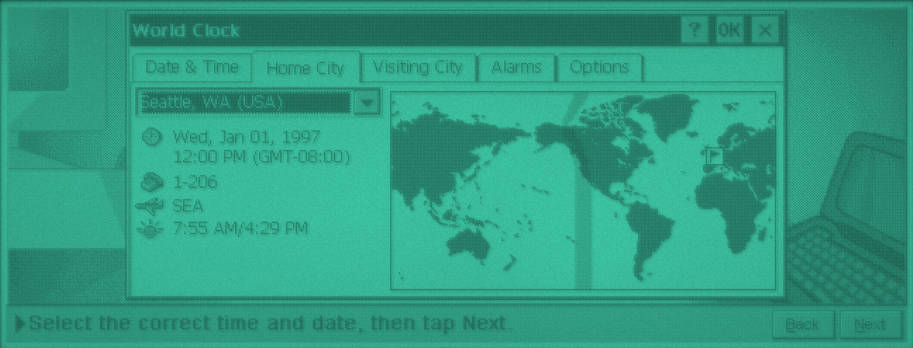
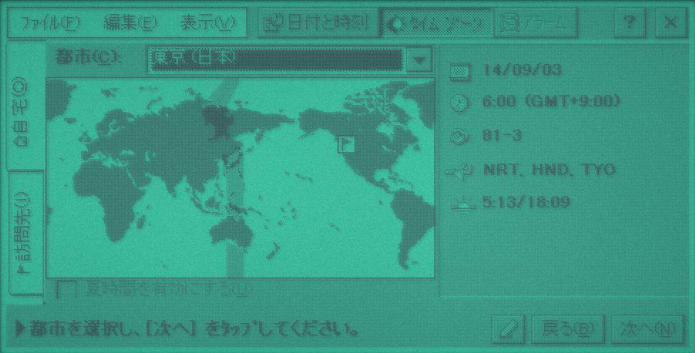

# sh3-emu

An emulator for Windows CE handhelds built on the Hitachi SH-3. It runs the ROMs of the Casio Cassiopeia A-51 (CE 1.01, Japanese) and the HP 320LX (CE 2.0), with a simulated LCD, the keyboard and touch panel, PC Card images, a serial port with a PPP network, and a GDB stub. It's a hard fork of [velo-emu](https://github.com/Gadgetoid/velo-emu), the Philips Velo 1 emulator, with an SH-3 core in place of the MIPS one.




## Install

- **macOS (Apple silicon):** `SH3Emu.app`, from a release or `make app`. It isn't notarised: allow it in System Settings > Privacy & Security > Open Anyway, or run `xattr -dr com.apple.quarantine SH3Emu.app`.
- **Debian 12 or later and Ubuntu 24.04 or later:** the `.deb`, from a release or `tools/mkdeb.sh`. It installs `sh3emu`, `sh3emu-headless` and `sh3emu-rapi`, with a desktop entry, and `mkcard.sh` in `/usr/share/sh3-emu`.
- **From source:** see Building.

## Supported ROMs

No ROMs are included. Put them in the `roms` folder of the data folder (see GUI) and make a machine with Machine > New Machine, or pass one on the command line. The machine is picked from the ROM's contents. A raw flash dump can be the whole chip or end at the ROM header's `physlast`:

| Machine | ROM | CE | Working |
|---|---|---|---|
| Casio Cassiopeia A-51 | a raw dump of its flash | 1.01 (Japanese) | desktop, keyboard, touch, backlight, PC Card, serial, dictionary ROM |
| HP 320LX | a raw dump of its flash | 2.0 | setup wizard, keyboard, touch, sound, backlight, suspend and resume, serial |

## Running

```
make
./headless rom/nk-hp320lx.bin --seconds=20 --save=wizard.state --png=wizard.png
./headless rom/nk-hp320lx.bin --load=wizard.state --seconds=8 --key=1:9F --key=2:2D "--type=3:Hello\n" --png=run.png
./headless --help
```

Each option is its own argument: in zsh, `KEYS="--key=... --type=..."; ./headless $KEYS` passes them as one, which `headless` rejects.

`--key` takes PS/2 set 2 scancodes in hex, joined by `+` for a chord; codes from 80 up are sent with the E0 prefix. `--type` types text with `\n` for Enter. `--tap` holds the pen at a screen position. `--power` presses the power button, and `--backlight` the backlight key. `--debug-output` prints the kernel's debug serial port. `--trace-exceptions` logs CPU exceptions other than TLB misses and CE's system call traps. `--pgm` and `--png` save the screen, `--wav` saves the sound, and `--save` and `--load` keep the machine's state. Runs are deterministic.

## Storage card

The Casio A-51's PC Card slot takes a CompactFlash card in ATA mode, backed by a raw disk image, which CE mounts as `\Storage Card`. Make one, optionally copying folders onto it, and insert it with `--card` (after `--load`, if both are given; a state keeps its card, and a different image is swapped in a second later so CE sees the removal):

```
tools/mkcard.sh card.img 16 ~/some/folder
./headless rom/nk-a51-ce1.01.bin --card=card.img --seconds=30
```

`mkcard.sh` uses `hdiutil` on macOS and `sfdisk`, `mkfs.fat` and `mtools` on Linux. To read the image on the host, `hdiutil attach -imagekey diskimage-class=CRawDiskImage card.img` on macOS or `mcopy -i card.img@@512` on Linux.

The card has a CompactFlash CIS, a configuration option register, and ATA IDENTIFY, READ and WRITE SECTORS (LBA and CHS) through memory, contiguous I/O or primary/secondary I/O decoding.

## Network

COM1 is the SCIF on both machines. `--net`, or Devices > Serial Port > Network (PPP) in `sh3emu`, plugs it into a PPP server on a libslirp user-mode network, as velo-emu does: CE gets 10.0.2.15, the host is 10.0.2.2 (the host's loopback), and DNS is 10.0.2.3, which forwards to the host's resolver and answers `host` itself with 10.0.2.2. Connections are outgoing only. Without libslirp the emulator builds without the network.

The Casio A-51 (DSR on the board ASIC) and the HP 320LX (PH2 low, IRQ2) notice the cable going in and start their own desktop connection: CE sends `CLIENT`, the gateway answers `CLIENTSERVER`, and PPP comes up. CE then connects to the desktop at 10.0.2.2 port 5679, as it did with Handheld PC Explorer, and the emulator accepts the connection, sending the ping CE 2.0 requires every second. The gateway looks for `CLIENT` anywhere in what CE sends first, so stray text on the port doesn't stop it.

```
./headless rom/nk-hp320lx.bin --net=20 --seconds=40
```

CE only connects when it sees the cable go in once it's running, not when the cable is already in at boot. So `--net` plugs the cable in 20 seconds after a cold boot, and 2 seconds after `--load` (the GUI does the same after a state load or a machine switch), so CE notices it was out and connects again rather than reusing a PPP session the new gateway doesn't have. `--net=SECONDS` picks the time. After a soft reset CE takes longer to be ready for the cable, so the GUI unplugs it and plugs it back in 30 seconds later. `--replug=SECONDS` unplugs the cable and plugs it back into a new gateway 2 seconds later, and CE connects again.

The desktop then reaches the device with RAPI, CE's remote API, on its port 990. `headless --rapi=SOCKET` exposes it on a Unix socket (keep the path short), or `--rapi-port=PORT` on a TCP port on all interfaces, and `sh3emu-rapi` uses it, on both CE 1.01 and 2.0:

```
./headless rom/nk-a51-ce1.01.bin --net=22 --rapi=/tmp/a51.sock --realtime=1 --seconds=600 &
sh3emu-rapi --socket=/tmp/a51.sock info
sh3emu-rapi --socket=/tmp/a51.sock put notes.txt
sh3emu-rapi --socket=/tmp/a51.sock ls
sh3emu-rapi --socket=/tmp/a51.sock get notes.txt
sh3emu-rapi --help
```

In `sh3emu`, the PC Link menu uses it: Send Files to Device copies files into `\My Documents`, and Copy My Documents to Mac (or Computer) copies `\My Documents`, with its folders, into a host folder. Shared Folder pairs a host folder with `\My Documents` and syncs them each time the device connects, or with Sync Shared Folder Now: a file changed on one side is copied to the other, and a file deleted on one side and unchanged on the other since the last sync is deleted there too. Dropping files on the window sends them, and dropping an H/PC Explorer `.load` script installs it. The RAPI socket is `rapi.sock` in the data folder, which `sh3emu-rapi` uses by default.

PC Link > Device Settings changes the device over RAPI:

- Set Up Pocket IE Proxy points Pocket IE at the emulator's web proxy, 10.0.2.4 port 8080, from the next time Pocket IE starts (`sh3emu-rapi proxy on` does the same). The proxy fetches pages on the host with libcurl, over HTTPS too, and turns pages and images into something Pocket IE 2.0 can show: it strips scripts and styles, and converts PNG, JPEG and SVG images to GIF. It's built when libcurl is there. Pocket IE won't send the device's own address, 127.0.0.1, to a proxy, so use a name or the host's address.
- RAPI over the Network also offers RAPI on TCP port 9990 on all interfaces, for `sh3emu-rapi --connect=HOST:9990` from another computer, and says the address.
- Connection Speed picks the HP 320LX's desktop connection, from 19200 to 115200 baud (`sh3emu-rapi baud`); the emulator then unplugs and replugs the cable so CE dials at the new speed. The Casio A-51's CE 1.01 ignores the speed in a new connection entry and stays at 19200, so it's only offered on the HP.

`sh3emu-rapi` also copies folders, reads and writes the registry, starts programs, syncs a folder, and runs H/PC Explorer `.load` install scripts (taking the `.sh3` build where there is one). Paths are relative to `\My Documents` unless they start with `/` or `\`.

Devices > Serial Port can instead connect COM1 to a pseudo-terminal (its name is in the notice and on stderr) or to a host serial port, for a real desktop or another program at the other end. A host port follows CE's baud rate. `headless --pty[=SECONDS]` does the pseudo-terminal, naming it on stderr.

## Debugging

The host mailbox and GDB stub are velo-emu's, ported to the SH-3.

- Host mailbox: a user-mode `trapa #0xCE` with r4 = operation (0 probe, 1 receive, 2 send), r5 = buffer and r6 = length returns its result in r0, and the probe's maximum message size in r1. `--agent=SOCKET` passes the messages to one client on a Unix socket, framed as a little-endian u32 length and the message. A guest helper:

  ```
  _host_call:            ; int host_call(int operation, void *buffer, int length, int *extra)
  	mov.l	r7, @-r15
  	trapa	#h'CE
  	mov.l	@r15+, r7
  	tst	r7, r7
  	bt	done
  	mov.l	r1, @r7
  done:
  	rts
  	nop
  ```

- `--gdb=PORT` serves GDB's remote protocol. The target description names the `sh3` architecture, and the `g` packet follows GDB's SH-3 register layout (r0-r15, pc, pr, gbr, vbr, mach, macl, sr, unused FPU slots, ssr, spc and both banks of r0-r7). Breakpoints, watchpoints and single steps are the emulator's own, not code patches. `monitor processes` and `monitor modules` read CE 1.01's and 2.0's process and module lists. File transfer and starting programs need a guest agent (velo-toolchain's debugmgr), which isn't built for these devices yet.

```
./headless rom/nk-hp320lx.bin --seconds=20 --save=wizard.state
./headless rom/nk-hp320lx.bin --load=wizard.state --gdb=1234
gdb -ex "set architecture sh3" -ex "target remote :1234"
```

## Casio Cassiopeia A-51

A ROM image without `hplib.dll` runs on the Casio Cassiopeia A-51: the Japanese Windows CE 1.01 H/PC. The image is mapped as flash at physical 0 and the CPU starts at the reset vector, as on the device. The one tested is `nk-a51-ce1.01.bin` (sha256 `d9fad038ec4f3349a0e3767244fb40122d9e2088c9269e2fdc838a11f5192d3b`), the device's 16 MB flash from 0 to the ROM header's `physlast` (the whole 16 MB also runs); `make test` uses it from `rom/nk-a51-ce1.01.bin` (or `CASIO_ROM=PATH`) if it's there. It boots to the H/PC Setup Wizard and on to the desktop, with the keyboard, the touch panel and the PC Card slot working: `--card` puts a CompactFlash card image in the slot, which CE mounts as `\Storage Card`. The AC adapter is reported as plugged in, so CE doesn't ask before using a card on battery. A cold boot waits in standby for the ON key, as the device does after its batteries go in; the emulator presses it.

```
./headless rom/nk-a51-ce1.01.bin --seconds=20 --debug-output --png=wizard.png
./headless rom/nk-a51-ce1.01.bin --seconds=47 --key=20:5A --key=23:5A --tap=25:240:120:1.5 --tap=28:48:48:1.5 --tap=31:48:192:1.5 \
    --tap=34:432:192:1.5 --tap=37:432:48:1.5 --key=40:5A --tap=44:447:227:0.2 --png=time-zone.png
```

That presses Enter twice, taps the five calibration targets (hold each for a second), accepts the calibration, and taps Next to reach the time zone page.

The keyboard is a 9x8 matrix. PS/2 keys map to it by position, with the Japanese keys on 無変換 (67), 変換 (64) and カタカナ (13), CapsLock on the key at the end of the number row, and Right Ctrl as Fn.

`tools/ce1rom.py IMAGE FOLDER` lists a CE 1.0 ROM image's header, copy entries, modules (with their sections) and files in `FOLDER/manifest.txt`, and extracts the modules as PE files and the files, decompressed, into `FOLDER/modules` and `FOLDER/files`.

The A-51's dictionary app (`dic.exe`, G-天王星) reads its English-Japanese dictionary from a separate 8 MB ROM at physical 0x04000000. `--dictionary=IMAGE`, or Devices > Mount Dictionary in `sh3emu`, maps a dump of it there, read-only; the GUI remembers it for the Casio's machines. Without one the app finds nothing.

## HP 320LX

A ROM image containing `hplib.dll` runs on the HP 320LX: the Windows CE 2.0 H/PC with an SH7709. The one tested is `nk-hp320lx.bin` (sha256 `d675014fcd73bd8a3842e97142b153a27b2eb71cce436d77ddb3b04c50f50016`), the first `physlast` bytes of a full 32 MB dump, which also runs as it is; `make test` uses it from `rom/nk-hp320lx.bin` (or `HP_ROM=PATH`) if it's there. It boots to the H/PC Setup Wizard, with the keyboard and the touch panel working. There's no PC Card yet.

```
./headless rom/nk-hp320lx.bin --seconds=45 --key=20.5:5A --key=22:5A --tap=24:320:120:1.5 --tap=27:128:48:1.5 --tap=30:128:192:1.5 \
    --tap=33:512:192:1.5 --tap=36:512:48:1.5 --key=38:5A --png=world-clock.png
```

That presses Enter twice, taps the five calibration targets, and accepts the calibration to reach the World Clock page.

The AC adapter is reported as plugged in, so CE doesn't warn that battery power may not be enough for a serial connection, and doesn't suspend on its own. Sound plays: wavedev.dll double-buffers 8-bit samples at 0x0C004000 and 0x0C004800, and DMA channels 0 and 2 copy them to the CPU's D/A converter channel 1 at the compare match timer's rate, which is the WAV file's sample rate. The emulator resamples what reaches the converter to 22050 Hz.

Start > Suspend suspends it; any key then presses the ON key (IRQ0) and wakes it, and that key press goes no further.

The keyboard is an 8x11 matrix scanned by the OAL through the CPU's ports. PS/2 keys map to it by the virtual key the HP driver gives each position; the Windows key is Start. A key change reaches CE only after the matrix has been stable for several scans, so key changes are queued and each is held for 8 scans, which slows typing to a few characters a second.

```
./headless rom/nk-hp320lx.bin --seconds=20 --debug-output --png=wizard.png
```

## What's emulated

- CPU (`src/core/sh3.c`): the SH-3 instruction set, little-endian, with delay slots; banked registers, SR.MD/RB/BL; exceptions, TRAPA and interrupts through VBR+0x100/0x400/0x600 with EXPEVT, INTEVT, TRA, SPC and SSR; the MMU with the 128-entry 4-way UTLB, 1 KB and 4 KB pages, ASIDs, shared pages, MMUCR (AT, IX, TF, RC, SV), LDTLB, TLB miss, invalid, protection and initial page write exceptions, and the memory-mapped TLB arrays; SLEEP. No FPU or DSP.
- On-chip peripherals (`src/core/sh7709.c`), SH7708 and SH7709: the INTC (IRL levels, IPRA to IPRE, IRQ0-5 on the SH7709, with edge or level sense per line), TMU channels 0-2 with underflow interrupts, the RTC (BCD counters, 64 Hz counter, alarm, periodic and carry interrupts), SCI, the two SH7709 SCIFs, the SH7709 DMA controller (four channels, compare match timer requests), compare match timer and D/A converter, the SH7709 A/D converter (single and multi modes, ADI), its split INTEVT/INTEVT2 codes and port input pins set by the board, and register storage for the BSC, CPG, WDT, CCR and the SH7709 ports. The cache isn't modelled.
- Machine (`src/core/machine.c`): 16 MB DRAM at 0x0C000000 (32 or 64 with `--memory`), the flash image at physical 0, the Casio dictionary ROM at 0x04000000, the serial FIFO behind COM1, the card slot, the host mailbox and saved states.

- Casio Cassiopeia A-51 board (`src/core/casio.c`): flash at physical 0, the 480x240 2 bpp display in 128 KB of video RAM at 0x08000000 (256 bytes a line), the board ASIC's register file at 0x10000000 (its write unlock, the power status, the PC Card socket (status at 0x326, card detect active low; its windows at 0x18000000, 0x19000000 and 0x1A000000 for attribute, common and I/O; a status change interrupt on vector 14 and the card's interrupt on vector 3) and an empty second socket (status at 0x282, windows in area 5), the backlight (0x08 bits 6 and 7; the key is at row 1, column 7 of the matrix), the AC adapter (0x260 bit 1), COM1's DSR (0x234 bit 2) with its edge enables and flags at 0x52 (an interrupt on vector 8) and its baud rate at 0x230 and 0x232, its interrupt mask, status, write-1-to-clear register and vector on an IRL, the pin registers at 0x40-0x66 reading inactive, the key matrix: rows selected at 0xE4, active-low columns at 0xE6, an interrupt while a key is down in the selected rows, and the touch panel: an interrupt on pen down, pen up at 0x8A, X and Y conversions selected by 0x8C and read from 0x98-0x9C, 64-960 across the screen), and the CPU's extra on-chip registers: two 32-bit up-counting timers at 0xFFFFFE20 and 0xFFFFFE40 with compare interrupts (INTEVT 0x6C0 and 0x6E0, priorities in 0xFFFFFEE6; clocked at the peripheral clock / 16, a guess), an SCIF at 0xFFFFFE70 (COM1; INTEVT 0x700-0x760, priority in 0xFFFFFEE6 bits 7-4), and register storage at 0xFFFFFE00 and 0xFFFFD000. The kernel scans the keys and samples the touch panel from the 0xFFFFFE20 timer's interrupt. The kernel's debug output is on the on-chip SCI. The kernel's startup calls an on-chip routine at 0xE00001DE, which isn't in the image; it's emulated as returning straight away. Not modelled: the ON key other than at the first cold boot, suspend, the battery, audio, and the second socket.

- HP 320LX board (`src/core/hp320lx.c`): flash at physical 0, the 640x240 2 bpp display at DRAM 0x0C005000 (160 bytes a line), the companion ASIC at 0x02000000 as register storage with its debug UART (output on `--debug-output`) and its parallel-port link reporting no host, the battery A/D channels reading a healthy level, port L reading 0x32 as on a real 320LX: bit 4 is the "Luke" hardware (2 bpp display, 44 MHz clock setup) and bit 5 a backlit screen, which gives Display its Backlight tab, the key matrix: rows driven low on PB3-7, PJ4, SCPT3 and PD7, columns read on PA0-7 and PB0-2, the touch panel: pen down on IRQ3 and A/D channel A while PH7 is low, X on channel A with PK2 high and Y on channel B with PK0 high, 64-960 across the screen, the ON key on IRQ0, the AC adapter on PD4, the backlight on PC3 (low is lit; the backlight key is row 7, column 4 of the matrix, which the kernel handles itself), the compare match timer, DMA channels 0 and 2 and D/A channel 1 for sound, and COM1 on SCIF2 with the cable detect on PH2 and IRQ2 (falling edge when it goes in, rising when it comes out) and DTR on PC2.

Guest time is the instruction count at 58.98 MHz. The peripheral clock is 10 MHz on the Casio A-51 and 11.0592 MHz on the HP 320LX, which give both kernels their 25 ms tick and the HP's serial driver its exact baud rates.

Not yet: sound on the Casio A-51, the IR port, the HP 320LX's PC Card slot, cards other than CompactFlash, and suspend on the Casio A-51.

## GUI

`make sh3emu` builds the windowed app (`make app` wraps it as `SH3Emu.app` on macOS). It runs the machine with the simulated LCD, PS/2 keyboard mapping and the mouse as the stylus, and takes `--card`, `--net`, `--memory`, `--agent` and `--gdb` like `headless`; Devices has the card and the serial port. Machines, states, snapshots and the ROMs folder live in `$XDG_DATA_HOME/sh3-emu` (otherwise `~/Library/Application Support/sh3-emu` on macOS, `~/.local/share/sh3-emu` elsewhere), and settings in `sh3emu.ini` in `$XDG_CONFIG_HOME/sh3-emu` (otherwise that data folder on macOS, `~/.config/sh3-emu` elsewhere), so it doesn't share anything with velo-emu.

Machine > New Machine lists the ROMs in the roms folder by machine. Machine > Power Button (Cmd-Shift-P) presses the HP 320LX's ON key, which wakes it from suspend, and the Casio A-51's. Devices > Sound turns the sound off and on. Machine > Backlight (Cmd-B) presses the backlight key, and is ticked while the backlight is on; the screen is drawn unlit until it is. On the HP 320LX, F9 is the backlight key too, as it's in F9's place in the key matrix. The title bar says when the machine is suspended.

## Testing

- `make check` needs no ROMs: the command lines, and the gateway's `CLIENT` handshake after stray text.
- `make test` runs the CPU tests and, with `rom/nk-a51-ce1.01.bin` (or `CASIO_ROM=PATH`), boots the Casio image and compares the Setup Wizard's framebuffer hash, before and after pressing Enter, after calibrating the touch panel, and with a card, after finishing the wizard and opening `\Storage Card`; checks the GDB stub; and that the backlight key lights the screen; with `rom/a51-dictionary.bin` (or `CASIO_DICTIONARY=PATH`), that the dictionary app shows its first entries; and with `--net`, that it brings PPP up and connects to the desktop, connects again after a replug and after a soft reset, and that a file goes there and back over RAPI. With `rom/nk-hp320lx.bin` (or `HP_ROM=PATH`) it boots the HP image and compares the Setup Wizard's framebuffer hash, after typing into Start > Run, after calibrating the touch panel and tapping a tab, and after Start > Suspend and a key to wake it; that the startup sound plays; that the backlight key lights the screen; checks the GDB stub; and with `--net`, that it brings PPP up and connects to the desktop, connects again after a replug and after a soft reset, and that a file goes there and back over RAPI.
- `tests/sh3/run.sh` assembles `tests/sh3/*.s` with an `sh-elf` binutils (`SH_PREFIX`) and runs them on `sh3-run`, a bare harness for the core: exceptions, banks, user mode and the MMU.
- `make sh3-fuzz` compares random user-mode instruction streams between `sh3-run` and a reference, `qemu-sh4` by default; `SH_REFERENCE=HOST:qemu-sh4` runs it on another machine over ssh. qemu 10.2 gets T wrong after ROTL and ROTR and DIV1 by zero, so the fuzzer avoids those.

## Building

macOS: `brew install sdl3 libslirp`, then `make`. Debian or Ubuntu: `sudo apt install build-essential pkg-config libsdl3-dev libslirp-dev libcurl4-openssl-dev zlib1g-dev`, then `make`. Without `libsdl3-dev` (Debian 12, Ubuntu 24.04), install `cmake curl libglib2.0-dev` and the X11 and Wayland development packages listed in `.github/workflows/build.yml`, then `sh tools/sdl3-static.sh` and `PKG_CONFIG_PATH=build/sdl3/lib/pkgconfig make SDL_STATIC=1`.

## Licence

MIT, see `LICENSE`. ROMs and Windows CE software are not included.

## Credits

The SH-3 core and on-chip peripherals are written from Hitachi's SH-3 and SH7708/SH7709 hardware manuals and Microsoft's SH-3 reference; no emulator code was copied. The Casio A-51 and HP 320LX boards follow their ROMs' own drivers. velo-emu's tools and the rest of this tree also draw on [CERF](https://github.com/gweslab/cerf) (MIT, `licences/MIT-CERF.txt`), [stb_truetype](https://github.com/nothings/stb) (public domain) and [nanosvg](https://github.com/memononen/nanosvg) (zlib, `licences/Zlib-nanosvg.txt`).
