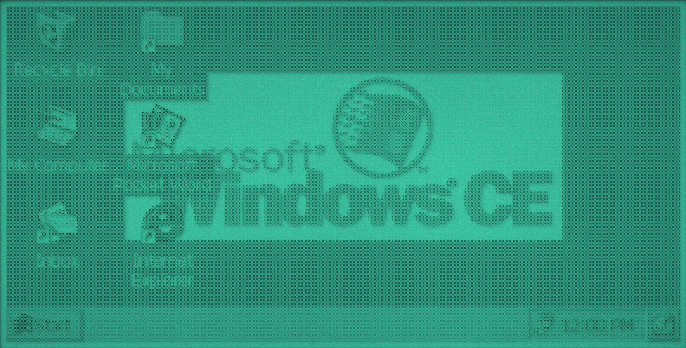
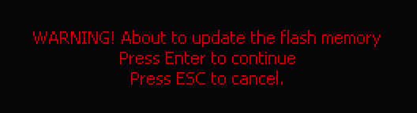

# sh3-emu

An emulator for Windows CE machines built on the Hitachi SH-3. It runs Microsoft's Odo reference board with Platform Builder images of CE 2.11 and 2.12, and the ROMs of three devices: the Clarion AutoPC, the Casio Cassiopeia A-51 and the HP 320LX. It has a simulated LCD, PC Card images, a PPP network, a host folder over PPFS and a GDB stub. It's a hard fork of [velo-emu](https://github.com/Gadgetoid/velo-emu), the Philips Velo 1 emulator, with an SH-3 core in place of the MIPS one.






## Install

- **macOS (Apple silicon):** `SH3Emu.app`, from a release or `make app`. It isn't notarised: allow it in System Settings > Privacy & Security > Open Anyway, or run `xattr -dr com.apple.quarantine SH3Emu.app`.
- **Debian 12 or later and Ubuntu 24.04 or later:** the `.deb`, from a release or `tools/mkdeb.sh`. It installs `sh3emu` and `sh3emu-headless`, with a desktop entry, and `mkcard.sh` in `/usr/share/sh3-emu`.
- **From source:** see Building.

## Supported ROMs

No ROMs are included. Put them in the `roms` folder of the data folder (see GUI) and make a machine with Machine > New Machine, or pass one on the command line. The board is picked from the ROM's contents. A raw flash dump can be the whole chip or end at the ROM header's `physlast`:

| Machine | ROM | CE | Working |
|---|---|---|---|
| Odo SH3 | a Platform Builder `nk.bin` for Odo SH3 (see [Odo images](#odo-images)) | 2.11, 2.12 beta | desktop, keyboard, touch, PC Card, PPFS, PPP, GDB |
| Clarion AutoPC | `BurnOS.bin`, the AutoPC's flash update OS | Auto PC (CE 2.0) | the update's prompts on the faceplate, Enter |
| Casio Cassiopeia A-51 | a raw dump of its flash | 1.01 (Japanese) | desktop, keyboard, touch, PC Card |
| HP 320LX | a raw dump of its flash | 2.0 | setup wizard, keyboard, touch, suspend and resume |

## Odo images

The Odo image to use is `odo-sh3-ce212.bin`, built by `tools/image/build.sh` from Platform Builder 2.12 beta for the Odo platform, SH3, MAXALL: the H/PC Explorer shell, Pocket Word, Pocket IE and Inbox, PPFS, the PC Card and CompactFlash drivers, serial and PPP with a dialer that keeps a connection up (see [Network](#network)), velo-toolchain's debugmgr as `\Windows\velo-debugmgr.exe`, a preset touch calibration (no calibration screen), and optionally some third-party SH3 apps under Start > Programs. Put it (or a symlink) at `rom/odo-sh3-ce212.bin`.

```
VELO_TOOLCHAIN=velo-toolchain VELO_SH3_LLVM=llvm guest/build.sh
PB212_TREE=pb212/tree DEBUGMGR=velo-toolchain/build/debugmgr/ce2-sh3/velo-debugmgr.exe NETDIAL=build/guest/netdial.exe \
    SH3_APPS=apps WINE=wine OUTPUT=rom/odo-sh3-ce212.bin tools/image/build.sh
```

- `PB212_TREE`: the Platform Builder 2.12 beta tree for SH3 (discs 1, 2, 6 and 7 merged; the disc 2 ARM libraries aren't needed). The script edits files in it, keeping each original as `NAME.orig` and starting from that on every run, so it's best given a copy.
- `DEBUGMGR`: velo-toolchain's `velo-debugmgr.exe` for SH3 (`make debugmgr-sh3` there).
- `NETDIAL`: the dialer from `guest/`, which `guest/build.sh` builds with velo-toolchain (`VELO_TOOLCHAIN`) and an SH3 LLVM (`VELO_SH3_LLVM`), with the network test program `nettest.exe`.
- `SH3_APPS`: optional folder with the apps listed in `tools/image/apps.txt`; missing ones are skipped.
- `WINE`: the Wine to run Platform Builder's tools with. The script makes its own prefix in `build/image` and maps W: there.
- `FULL=1` reruns blddemo (about 15 minutes); otherwise it runs only when the tree has no MAXALL build yet, and the platform build and makeimg take about a minute.

Wine stops a build that runs away (a log over 200 MB, or an xcopy prompt). The output has a manifest (`.manifest.txt`, the module and file lists) and a `.sha256`. The script's edits: Wine fixes to `SRCGEN1.BAT` and CPLMAIN's makefile, a 9 MB image slot at 8C700000 and RAM below it in `CONFIG.BIB`, and the files, shortcuts and registry entries in `tools/image`.

The tests want an SH3 program that isn't in ROM at `rom/mbtest.exe` (or `PPFS_PROGRAM=PATH`, a program that prints a debug line starting `NAME: `) for PPFS.

## Running

```
make
./headless rom/odo-sh3-ce212.bin --seconds=25 --save=desktop.state --png=desktop.png
./headless rom/odo-sh3-ce212.bin --load=desktop.state --seconds=10 --key=1:14+76 --type=2:r "--type=3:cmd\n" --png=cmd.png
./headless --help
```

The desktop is up 25 seconds after a cold boot. Ctrl+Esc (`14+76`) opens the Start menu and `r` its Run dialog. Each option is its own argument: in zsh, `KEYS="--key=... --type=..."; ./headless $KEYS` passes them as one, which `headless` rejects.

`--key` takes PS/2 set 2 scancodes in hex, joined by `+` for a chord; codes from 80 up are sent with the E0 prefix. `--type` types text with `\n` for Enter. `--debug-output` prints the kernel's debug serial port. `--trace-exceptions` logs CPU exceptions other than TLB misses and CE's system call traps. `--pgm` and `--png` save the screen, and `--save` and `--load` keep the machine's state. Runs are deterministic.

## Storage card

Socket 0 of the Odo PC Card controller takes a CompactFlash card in ATA mode, backed by a raw disk image. CE's PC Card, ATA and FAT drivers mount it as `\Storage Card`. Make one, optionally copying folders onto it, and insert it with `--card` (after `--load`, if both are given; a state keeps its card, and a different image is swapped in a second later so CE sees the removal):

```
tools/mkcard.sh card.img 16 ~/some/folder
./headless rom/odo-sh3-ce212.bin --load=desktop.state --card=card.img --seconds=10
```

`mkcard.sh` uses `hdiutil` on macOS and `sfdisk`, `mkfs.fat` and `mtools` on Linux. To read the image on the host, `hdiutil attach -imagekey diskimage-class=CRawDiskImage card.img` on macOS or `mcopy -i card.img@@512` on Linux.

The card has a CompactFlash CIS, a configuration option register, and ATA IDENTIFY, READ and WRITE SECTORS (LBA and CHS) through memory, contiguous I/O or primary/secondary I/O decoding. The SH-3's area 5 and 6 bus widths (BCR2) apply, so the BSP's switch to 16-bit windows gives word access to the ATA data register.

## Host folder (PPFS)

The Odo's parallel port carried Platform Builder's parallel-port file system: when CE can't find a program or DLL in ROM or the object store, the kernel asks the host for it. `--folder=DIR` makes the emulator that host, serving DIR, so programs built for SH3 run without rebuilding the image: copy `hello.exe` into DIR and run `hello` from Start > Run. Names are matched without their path and case-insensitively. Without `--folder`, the port answers that no file exists, so CE doesn't wait on a missing host. The folder isn't a drive CE can browse: start its programs by name from Run, `cmd` or a shortcut. Misses are logged as `ppfs: no NAME in DIR`; a folder that doesn't exist is an error.

## Network

COM1 is the Odo's product serial port (the system ASIC's DMA UART, which the BSP's `serial.dll` drives) or the HP 320LX's SCIF. `--net`, or Devices > Serial Port > Network (PPP) in `sh3emu`, plugs it into a PPP server on a libslirp user-mode network, as velo-emu does: CE gets 10.0.2.15, the host is 10.0.2.2 (the host's loopback), and DNS is 10.0.2.3, which forwards to the host's resolver and answers `host` itself with 10.0.2.2. Connections are outgoing only. Without libslirp the emulator builds without the network.

The image starts `\Windows\netdial.exe` at boot (`HKLM\init`), which makes a direct-connection RAS entry, `Odo Network`, on `Serial Cable on COM1:` and keeps it dialled: it dials, waits while connected, and dials again 5 seconds after a failure or disconnection. So once the cable is in, Winsock programs just work. CE's own desktop connection on cable insertion (`AutoCnct`) is off. A direct connection starts with CE sending `CLIENT` and the server answering `CLIENTSERVER`; the gateway looks for `CLIENT` anywhere in what CE sends first, so stray text on the port doesn't stop it.

```
./headless rom/odo-sh3-ce212.bin --net --seconds=60 --folder=build/guest --key=30:14+76 --type=31:r "--type=32:nettest 8000\n"
```

`--net=SECONDS` plugs the cable in at that time; after `--load`, the cable goes in 2 seconds after the start (and the GUI does the same on a state load or machine switch), so CE notices it was out and dials again rather than reusing a PPP session the new gateway doesn't have.

The HP 320LX notices the cable going in (PH2 low, IRQ2) and starts its own desktop connection: it sends `CLIENT`, the gateway answers, and PPP comes up. There's no desktop at the other end yet, so CE then reports that it can't start communications with the desktop computer.

Devices > Serial Port can instead connect COM1 to a pseudo-terminal (its name is in the notice and on stderr) or to a host serial port, for a real desktop or another program at the other end. A host port follows the HP's baud rate. `headless --pty[=SECONDS]` does the pseudo-terminal, naming it on stderr.

## Debugging and file transfer

The host mailbox and GDB stub are velo-emu's, ported to the SH-3.

- Host mailbox: a user-mode `trapa #0xCE` with r4 = operation (0 probe, 1 receive, 2 send), r5 = buffer and r6 = length returns its result in r0, and the probe's maximum message size in r1. `--agent=SOCKET` passes the messages to one client on a Unix socket, framed as a little-endian u32 length and the message. A guest helper:

  ```
  _host_call:            ; int host_call(int operation, void *buffer, int length, int *extra)
  	mov.l	r7, @-r15
  	trapa	#h'CE
  	mov.l	@r15+, r7
  	tst	r7, r7
  	bt	done
  	mov.l	r1, @r7
  done:
  	rts
  	nop
  ```

- velo-toolchain's guest agent, debugmgr, is in the image as `velo-debugmgr.exe`. With it running on the device, file transfer, program start and kill work over `--agent`, and through the GDB stub.
- `--gdb=PORT` serves GDB's remote protocol. The target description names the `sh3` architecture, and the `g` packet follows GDB's SH-3 register layout (r0-r15, pc, pr, gbr, vbr, mach, macl, sr, unused FPU slots, ssr, spc and both banks of r0-r7). Breakpoints, watchpoints and single steps are the emulator's own, not code patches. `monitor processes` and `monitor modules` read CE 2.11's and 2.12's process and module lists. In extended mode (`target extended-remote`), `remote put` and `remote get`, `set remote exec-file` with `starti` or `run`, and `kill` go through debugmgr.

```
./headless rom/odo-sh3-ce212.bin --load=desktop.state --seconds=8 --key=1:14+76 --type=2:r "--type=3:velo-debugmgr\n" --save=debugmgr.state
./headless rom/odo-sh3-ce212.bin --load=debugmgr.state --gdb=1234
gdb -ex "set architecture sh3" -ex "target extended-remote :1234" -ex 'set remote exec-file \Windows\cmd.exe' -ex starti
```

## Clarion AutoPC

An image containing `apcdll.dll` runs on a Clarion AutoPC 310C board instead of the Odo. The one tested is `BurnOS.bin` (sha256 `dc09e84b046c247cbf5088ebee0a1185327981d0bd56586e04d9520c7c8c9a31`), the temporary OS that the AutoPC's update loads into RAM to burn a new `NK.BIN` into flash; `make test` uses it from `rom/autopc-burnos.bin` if it's there. It isn't the full AutoPC OS: its only program is `osupdate.exe`, which shows its prompts on the faceplate.

```
./headless rom/autopc-burnos.bin --seconds=15 --debug-output --png=faceplate.png
```

The emulator leaves the resident bootloader's download handshake in RAM, as the bootloader does before starting a downloaded image, so osupdate starts in its flash update step ("WARNING! About to update the flash memory"). Enter goes on to look for the update media and Esc cancels; cancelling asks for a reboot through the SH-3's watchdog, which isn't emulated, so the machine stops there.

The faceplate keys are a 5x6 matrix the faceplate driver scans over the link. PS/2 keys map to them: the arrows, Enter, Esc, the left Windows key, Alt, 0-9, F1, F2, F5, F6 and F7 (`--key=SECONDS:5A` presses Enter). Unknown register accesses are logged once per address and instruction.

## Casio Cassiopeia A-51

A raw ROM image (not B000FF) without `hplib.dll` runs on a Casio Cassiopeia A-51 board: the Japanese Windows CE 1.01 H/PC. The image is mapped as flash at physical 0 and the CPU starts at the reset vector, as on the device. The one tested is `nk-a51-ce1.01.bin` (sha256 `d9fad038ec4f3349a0e3767244fb40122d9e2088c9269e2fdc838a11f5192d3b`), the device's 16 MB flash from 0 to the ROM header's `physlast` (the whole 16 MB also runs); `make test` uses it from `rom/nk-a51-ce1.01.bin` (or `CASIO_ROM=PATH`) if it's there. It boots to the H/PC Setup Wizard and on to the desktop, with the keyboard, the touch panel and the PC Card slot working: `--card` puts a CompactFlash card image in the slot, which CE mounts as `\Storage Card`. The AC adapter is reported as plugged in, so CE doesn't ask before using a card on battery. A cold boot waits in standby for the ON key, as the device does after its batteries go in; the emulator presses it.

```
./headless rom/nk-a51-ce1.01.bin --seconds=20 --debug-output --png=wizard.png
./headless rom/nk-a51-ce1.01.bin --seconds=47 --key=20:5A --key=23:5A --tap=25:240:120:1.5 --tap=28:48:48:1.5 --tap=31:48:192:1.5 \
    --tap=34:432:192:1.5 --tap=37:432:48:1.5 --key=40:5A --tap=44:447:227:0.2 --png=time-zone.png
```

That presses Enter twice, taps the five calibration targets (hold each for a second), accepts the calibration, and taps Next to reach the time zone page.

The keyboard is a 9x8 matrix. PS/2 keys map to it by position, with the Japanese keys on 無変換 (67), 変換 (64) and カタカナ (13), CapsLock on the key at the end of the number row, and Right Ctrl as Fn.

`tools/ce1rom.py IMAGE FOLDER` lists a CE 1.0 ROM image's header, copy entries, modules (with their sections) and files in `FOLDER/manifest.txt`, and extracts the modules as PE files and the files, decompressed, into `FOLDER/modules` and `FOLDER/files`.


## HP 320LX

A raw ROM image containing `hplib.dll` runs on an HP 320LX board: the Windows CE 2.0 H/PC with an SH7709. The one tested is `nk-hp320lx.bin` (sha256 `d675014fcd73bd8a3842e97142b153a27b2eb71cce436d77ddb3b04c50f50016`), the first `physlast` bytes of a full 32 MB dump, which also runs as it is; `make test` uses it from `rom/nk-hp320lx.bin` (or `HP_ROM=PATH`) if it's there. It boots to the H/PC Setup Wizard, with the keyboard and the touch panel working. There's no PC Card yet.

```
./headless rom/nk-hp320lx.bin --seconds=45 --key=20.5:5A --key=22:5A --tap=24:320:120:1.5 --tap=27:128:48:1.5 --tap=30:128:192:1.5 \
    --tap=33:512:192:1.5 --tap=36:512:48:1.5 --key=38:5A --png=world-clock.png
```

That presses Enter twice, taps the five calibration targets, and accepts the calibration to reach the World Clock page.

CE suspends after three minutes without input, as on battery. Any key then presses the ON key (IRQ0) and wakes it; that key press goes no further.

The keyboard is an 8x11 matrix scanned by the OAL through the CPU's ports. PS/2 keys map to it by the virtual key the HP driver gives each position; the Windows key is Start. A key change reaches CE only after the matrix has been stable for several scans, so key changes are queued and each is held for 8 scans, which slows typing to a few characters a second.

```
./headless rom/nk-hp320lx.bin --seconds=20 --debug-output --png=wizard.png
```


## What's emulated

- CPU (`src/core/sh3.c`): the SH-3 instruction set, little-endian, with delay slots; banked registers, SR.MD/RB/BL; exceptions, TRAPA and interrupts through VBR+0x100/0x400/0x600 with EXPEVT, INTEVT, TRA, SPC and SSR; the MMU with the 128-entry 4-way UTLB, 1 KB and 4 KB pages, ASIDs, shared pages, MMUCR (AT, IX, TF, RC, SV), LDTLB, TLB miss, invalid, protection and initial page write exceptions, and the memory-mapped TLB arrays; SLEEP. No FPU or DSP.
- On-chip peripherals (`src/core/sh7709.c`), SH7708 and SH7709: the INTC (IRL levels, IPRA to IPRE, IRQ0-5 on the SH7709), TMU channels 0-2 with underflow interrupts, the RTC (BCD counters, 64 Hz counter, alarm, periodic and carry interrupts), SCI, the two SH7709 SCIFs, the SH7709 A/D converter (single and multi modes, ADI), its split INTEVT/INTEVT2 codes and port input pins set by the board, and register storage for the BSC, CPG, WDT, CCR and the SH7709 ports. The cache isn't modelled.
- Odo board (`src/core/machine.c`): 16 MB DRAM at 0x0C000000 (32 or 64 with `--memory`), the system ASIC at 0x10000000 (interrupt status and mask on IRL level 4, debug serial port output, the 480x240 2 bpp display DMA, the PS/2 keyboard, the touch and sound block with the UCB register interface and pen timer, the PC Card controller with a CompactFlash card in socket 0), and the housekeeping FPGA (LEDs and the parallel port).

- AutoPC board (`src/core/autopc.c`): the 16550 debug UART at 0x10800000, the board FPGA's register file at 0x11000000 (ignition on, powered-on boot), the PCI host bridge at 0x10000000 with configuration cycles at 0x0A000000, and the Clarion faceplate controller (PCI 1398:0003) in slot 1: its interrupt status and mask on IRL level 8, its memory BAR, and the DMA link to the faceplate, which carries the faceplate's control port, LCD controller registers (read back with the bits the driver expects), the 256x64 display memory (an 8-colour RGB STN, one bit per channel; which bit is which channel is a guess) and the key matrix. The PC Card controller at 0x11800000 has the CompactFlash card from `--card` in socket 0, with its interrupts through the board FPGA (pending 0x1100000C, mask 0x11000008); CE configures it and reads sectors, but osupdate doesn't find `NK.BIN` on it yet. Not modelled: the faceplate's other keys and messages, the IR remote, flash, the CD drive's IDE controller, audio, and the tuner.

- Casio Cassiopeia A-51 board (`src/core/casio.c`): flash at physical 0, the 480x240 2 bpp display in 128 KB of video RAM at 0x08000000 (256 bytes a line), the board ASIC's register file at 0x10000000 (its write unlock, the power status, the PC Card socket (status at 0x326, card detect active low; its windows at 0x18000000, 0x19000000 and 0x1A000000 for attribute, common and I/O; a status change interrupt on vector 14 and the card's interrupt on vector 3) and an empty second socket (status at 0x282, windows in area 5), the AC adapter (0x260 bit 1), its interrupt mask, status, write-1-to-clear register and vector on an IRL, the pin registers at 0x40-0x66 reading inactive, the key matrix: rows selected at 0xE4, active-low columns at 0xE6, an interrupt while a key is down in the selected rows, and the touch panel: an interrupt on pen down, pen up at 0x8A, X and Y conversions selected by 0x8C and read from 0x98-0x9C, 64-960 across the screen), and the CPU's extra on-chip registers: two 32-bit up-counting timers at 0xFFFFFE20 and 0xFFFFFE40 with compare interrupts (INTEVT 0x6C0 and 0x6E0, priorities in 0xFFFFFEE6; the clock, the peripheral clock / 16, is a guess), and register storage at 0xFFFFFE00 and 0xFFFFD000. The kernel scans the keys and samples the touch panel from the 0xFFFFFE20 timer's interrupt. The kernel's debug output is on the on-chip SCI. The kernel's startup calls an on-chip routine at 0xE00001DE, which isn't in the image; it's emulated as returning straight away. Not modelled: the ON key other than at the first cold boot, suspend, the battery, audio, serial, and the second socket.

- HP 320LX board (`src/core/hp320lx.c`): flash at physical 0, the 640x240 2 bpp display at DRAM 0x0C005000 (160 bytes a line), the companion ASIC at 0x02000000 as register storage with its debug UART (output on `--debug-output`) and its parallel-port link reporting no host, the battery A/D channels reading a healthy level, port L bit 4 set, which the boot code reads as the 320LX's "Luke" hardware (2 bpp display, 44 MHz clock setup), the key matrix: rows driven low on PB3-7, PJ4, SCPT3 and PD7, columns read on PA0-7 and PB0-2, the touch panel: pen down on IRQ3 and A/D channel A while PH7 is low, X on channel A with PK2 high and Y on channel B with PK0 high, 64-960 across the screen, the ON key on IRQ0, and COM1 on SCIF2 with the cable detect on PH2 and IRQ2 and DTR on PC2.

Guest time is the instruction count at 58.98 MHz, with the peripheral clock at 14.75 MHz.

Not yet: sound output, the IR port, PC Cards other than CompactFlash in socket 0, suspend, and PPFS's registry calls.

## GUI

`make sh3emu` builds the windowed app (`make app` wraps it as `SH3Emu.app` on macOS). It runs the board with the simulated LCD, PS/2 keyboard mapping and the mouse as the stylus, and takes `--card`, `--folder`, `--net`, `--memory`, `--agent` and `--gdb` like `headless`; Devices has the card, the PPFS host folder and the network. Machines, states, snapshots and the ROMs folder live in `$XDG_DATA_HOME/sh3-emu` (otherwise `~/Library/Application Support/sh3-emu` on macOS, `~/.local/share/sh3-emu` elsewhere), and settings in `sh3emu.ini` in `$XDG_CONFIG_HOME/sh3-emu` (otherwise that data folder on macOS, `~/.config/sh3-emu` elsewhere), so it doesn't share anything with velo-emu.

Machine > New Machine lists the ROMs in the roms folder by board: Odo SH3, Clarion AutoPC, Casio A-51 or HP 320LX. Machine > Power Button (Cmd-Shift-P) presses the HP 320LX's ON key, which wakes it from suspend, and the Casio A-51's; `headless` does the same with `--power=SECONDS`.

## Testing

- `make check` needs no ROMs: the command lines, and the gateway's `CLIENT` handshake after stray text.
- `make test` runs the CPU tests, boots `rom/odo-sh3-ce212.bin` (or `make test ROM=PATH`) to the desktop, the Start menu (a tap, so it checks the preset calibration) and the console comparing framebuffer hashes, checks the GDB stub, inserts a card image into the running desktop and has CE copy a file on it (checked on the host), starts debugmgr and checks GDB's file transfer, run, step and kill through it, runs a program from `--folder` through Start > Run, and with `--net` runs `nettest` (from `guest/build.sh`, or `NET_PROGRAM=PATH`), which resolves `host` and makes two HTTP requests to a local server; the server checks the requests. With `rom/autopc-burnos.bin` (or `AUTOPC_ROM=PATH`) it also boots the AutoPC image and compares the faceplate's framebuffer hash, before and after pressing Enter, and with `rom/nk-a51-ce1.01.bin` (or `CASIO_ROM=PATH`) it boots the Casio image and compares the Setup Wizard's framebuffer hash, before and after pressing Enter, after calibrating the touch panel, and with a card, after finishing the wizard and opening `\Storage Card`, and with `rom/nk-hp320lx.bin` (or `HP_ROM=PATH`) it boots the HP image and compares the Setup Wizard's framebuffer hash, after typing into Start > Run, and after calibrating the touch panel and tapping a tab, after it suspends and a key wakes it, and with `--net`, that it brings PPP up.
- `tests/gui.sh` (Linux, needs Xorg's dummy driver and python3-xlib) starts `sh3emu` on a headless X server, opens the console and lists a directory with injected mouse and key events, saves a screenshot, runs `nettest` over `--net` and `mbtest` from the host folder set in `sh3emu.ini`, and checks it used its own data folder.
- `tests/sh3/run.sh` assembles `tests/sh3/*.s` with an `sh-elf` binutils (`SH_PREFIX`) and runs them on `sh3-run`, a bare harness for the core: exceptions, banks, user mode and the MMU.
- `make sh3-fuzz` compares random user-mode instruction streams between `sh3-run` and a reference, `qemu-sh4` by default; `SH_REFERENCE=HOST:qemu-sh4` runs it on another machine over ssh. qemu 10.2 gets T wrong after ROTL and ROTR and DIV1 by zero, so the fuzzer avoids those.

## Building

macOS: `brew install sdl3 libslirp`, then `make`. Debian or Ubuntu: `sudo apt install build-essential pkg-config libsdl3-dev libslirp-dev libcurl4-openssl-dev zlib1g-dev`, then `make`. Without `libsdl3-dev` (Debian 12, Ubuntu 24.04), install `cmake curl libglib2.0-dev` and the X11 and Wayland development packages listed in `.github/workflows/build.yml`, then `sh tools/sdl3-static.sh` and `PKG_CONFIG_PATH=build/sdl3/lib/pkgconfig make SDL_STATIC=1`.

## Licence

MIT, see `LICENSE`. ROMs and Windows CE software are not included.

## Credits

The SH-3 core and on-chip peripherals are written from Hitachi's SH-3 and SH7708/SH7709 hardware manuals and Microsoft's SH-3 reference; no emulator code was copied. The Odo system ASIC's register behaviour follows the Odo board support package in Platform Builder 2.11 and CERF's Odo ARM720 board (MIT, `licences/MIT-CERF.txt`), which shares the ASIC. velo-emu's tools and the rest of this tree also draw on [CERF](https://github.com/gweslab/cerf), [stb_truetype](https://github.com/nothings/stb) (public domain) and [nanosvg](https://github.com/memononen/nanosvg) (zlib, `licences/Zlib-nanosvg.txt`).
